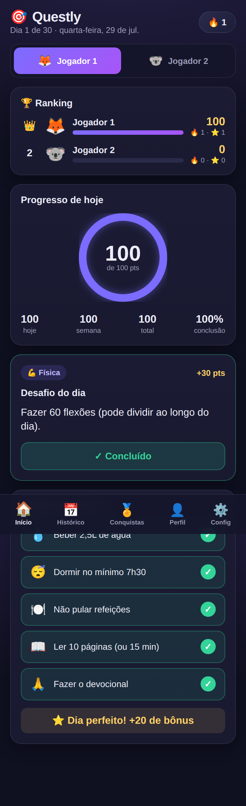
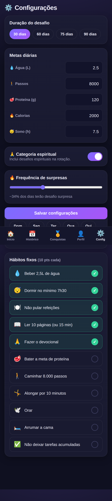

# 🎯 Questly

> App de hábitos, rotinas e treino que recompensa a **constância** — sozinho, em
> casal ou em grupo. Tudo que é feito pode ser desfeito.

Questly organiza o dia em hábitos, rotinas e agenda, registra o treino e a
alimentação de verdade, e transforma manter isso de pé num jogo: pontos,
sequência com marcos, conquistas e um placar mensal entre quem está junto.
Interface **mobile-first**, instalável como app (PWA).

<p align="center">
  
  
  
</p>

---

## ✨ O que o app faz

**O dia**
- 🏠 **Meu Dia**: agenda, rotinas e hábitos de hoje numa tela só, com a sequência e o que falta para o próximo marco.
- ✅ **Hábitos** próprios com frequência, horário, meta e lembrete. Hábito é
  sempre da pessoa, nunca do grupo: o que o grupo combina é o desafio por área.
- 🔁 **Rotinas**: sequências de passos (manhã, pré-treino, antes de dormir) que fecham quando os obrigatórios saem.
- 📅 **Agenda** pessoal com recorrência e lembretes.
- 😴 **Descanso planejado**: dia marcado como folga não conta como falha nem quebra a sequência.

**O esforço**
- 🏃 **Registro de atividade** por modalidade (corrida, bike, musculação, jiu-jitsu…), com os parâmetros que a pontuação realmente usa.
- 🧠 **Plano de treino** gerado por IA em semanas e sessões marcáveis — e ajustável por conversa quando a vida muda.
- 🍽️ **Alimentação**: refeição por foto, por texto, por alimento da tabela ou digitada; água com meta diária.

**O grupo**
- 👥 **Espaços**: individual, casal ou grupo — cada tipo liga o que faz sentido (ranking, atividade em dupla, convite).
- 🏆 **Placar mensal** com esforço, constância e desafios, e aviso de quem passou você.
- 📰 **Feed** com reações e comentários, **Mural** de fotos e **chat** do grupo.
- 📣 **Divulgar conquista**: sequência, medalha, sessão do plano ou a semana vão
  ao feed quando você quiser — e há a opção de publicar o fecho do dia sozinho.
- 👏 **Empurrão**: mandar força a quem está parado ou aplaudir quem mandou bem,
  um por pessoa por dia.
- 🎯 **Meta do grupo**: um número que todos somam junto (km, treinos, dias, pontos).
- ⚔️ **Duelo da semana**: você contra outra pessoa do grupo, sorteado toda segunda.
- 🗞️ **Retrospectiva do grupo**: o app posta o pódio da semana no feed.
- 🎲 **Desafio do dia** por área (Física, Mental, Social, Relação, Espiritual), sorteado igual para todos.

**O olhar para trás**
- 📈 **Sua semana**: retrospectiva com números, comparação com a semana anterior e o melhor dia.
- 🏅 **Conquistas** em duas famílias: o seu progresso (valem em qualquer espaço) e o desafio do grupo.
- 🔥 **Sequência** com recorde pessoal e **resgate** de dia perdido (2 por mês).

## 🧮 Como a pontuação funciona

Duas moedas, de propósito:

| | O que é | Tem teto? |
|---|---|---|
| **XP** | Evolução pessoal. Sobe com o que você fez e define seu nível. | Não |
| **Score** | O que ordena o placar do grupo. | Sim |

O score tem três origens:

| Origem | Quanto | Por quê |
|---|---|---|
| **Esforço** — atividade registrada | Distância × ritmo (corrida, bike, natação, caminhada) ou MET × duração (o resto) | Onde há percurso, arrastar 10 km por duas horas não pode render mais que fazê-los forte |
| **Constância** — hábito, rotina, dia fechado | 2 / 6 / 5 pts | Pequeno de propósito: um hábito não vale uma corrida. Mas marcar e não ganhar nada é o caminho mais curto para parar de marcar |
| **Sequência** — marcos | +10 aos 3 dias, +25 aos 7, +50 aos 14… até +2000 aos 365 | Marco à vista dá o que perder; pontinho diário some no ruído |

Limites que existem para o placar significar alguma coisa: retorno decrescente
na mesma modalidade no mesmo dia, teto diário de esforço, e validação de
plausibilidade (100 km em 20 min vira aviso, não pontuação).

**Nada é somado em contador.** XP e score são recalculados a partir do que está
gravado — é isso que faz desfazer devolver exatamente o que a ação deu.

## ↩️ Desfazer

Regra do app: **tudo que é feito pode ser desfeito**, e o caminho de volta
depende de quanto custa.

- **Tem volta** → acontece na hora e o aviso do rodapé oferece **Desfazer**: marcar/desmarcar hábito e rotina, concluir compromisso, água, refeição, tarefa, descanso.
- **Não tem volta** → folha de confirmação que **diz o que se perde**: apagar hábito, rotina, plano de treino, publicação do feed, registro de atividade.

Apagar um registro devolve o XP e os pontos exatos e tira a publicação do feed.
Apagar um hábito leva o histórico dele junto; para só dar uma folga existe
**pausar**, que preserva o passado.

## 🛠️ Tecnologias

- **Backend:** Python · FastAPI · SQLAlchemy 2 · Alembic · SQLite (ou Postgres via `DATABASE_URL`)
- **Frontend:** React 18 · Vite · React Router · PWA (vite-plugin-pwa)
- **Opcionais:** IA (Gemini / OpenAI / Groq) para plano de treino, rotinas, desafios e contador de calorias; Web Push para lembretes

## 📂 Estrutura

```
questly/
├── backend/
│   ├── app/
│   │   ├── main.py         # rotas
│   │   ├── models.py       # ORM
│   │   ├── scoring.py      # desafio do grupo (áreas, conquistas)
│   │   ├── scoring_v2.py   # esforço, XP, constância e marcos de sequência
│   │   ├── presets.py      # hábitos, rotinas, compromissos e metas prontos
│   │   ├── data.py         # desafios, conquistas, humores, reações
│   │   ├── ai.py           # IA (plano, rotina, desafios, calorias)
│   │   └── …
│   ├── migrations/         # Alembic
│   └── tests/              # pytest
└── frontend/
    └── src/
        ├── pages/          # MeuDia, Plano, Grupo, Feed, Perfil + sub-páginas
        ├── components/     # Toast (Desfazer), Confirmar, EscolherProntos, Sheet…
        ├── design-system/  # componentes e tokens
        ├── store.jsx       # estado global
        └── api.js          # cliente da API
```

## 🚀 Como rodar

### 1. Backend

```bash
cd backend
python3 -m venv .venv
source .venv/bin/activate        # Windows: .venv\Scripts\activate
pip install -r requirements.txt
uvicorn app.main:app --reload --port 8000
```

A API sobe em `http://localhost:8000` (docs em `/docs`). O banco SQLite é criado
e migrado na primeira execução.

### 2. Frontend

```bash
cd frontend
npm install
npm run dev
```

Abra `http://localhost:5173`. Para apontar para outra API, crie um `.env`:

```
VITE_API_URL=http://SEU_IP:8000
```

> 💡 Em produção o backend serve o frontend buildado (`frontend/dist`), então
> tudo roda num serviço só — sem CORS e sem `VITE_API_URL`.

### Variáveis de ambiente (todas opcionais)

| Variável | Para quê |
|---|---|
| `SECRET_KEY` | Assina os tokens de sessão. **Defina em produção** — sem ela os tokens usam uma chave padrão |
| `DATABASE_URL` | Usa Postgres em vez do SQLite local |
| `QUESTLY_DB` | Caminho do arquivo SQLite |
| `FRONTEND_DIST` | Onde está o `dist` que o backend serve |
| `GEMINI_API_KEY` / `OPENAI_API_KEY` / `GROQ_API_KEY` | Liga os recursos de IA |
| `VAPID_PUBLIC_KEY` / `VAPID_PRIVATE_KEY` | Liga o Web Push |
| `REMINDER_HOURS` / `WATER_REMINDER_HOURS` | Horas (UTC) dos lembretes |
| `GOOGLE_CLIENT_ID` | Liga o login com Google |
| `RESEND_API_KEY` / `BREVO_API_KEY` / `SMTP_*` | Envio do e-mail de redefinição de senha |

## ✅ Testes

```bash
cd backend && python -m pytest tests/ -q     # testes da API e da pontuação
cd frontend && npm run verify:props          # props e ícones fora do registro
cd frontend && npm run verify:ui             # varredura das telas no Chromium
```

A varredura de telas precisa do backend rodando na porta 8099 e do `dist`
buildado — veja o cabeçalho de `frontend/scripts/verify-ui.mjs`. As três rodam
no CI a cada PR.

## 🔌 Principais endpoints

| Método | Rota | Descrição |
|---|---|---|
| `GET` | `/api/today` | Meu Dia: agenda, rotinas, hábitos, treino, alimentação, sequência |
| `GET` | `/api/week/recap` | Retrospectiva da semana |
| `GET` | `/api/presets` | Hábitos, rotinas, compromissos e metas prontos |
| `POST` `DELETE` | `/api/habits`, `/api/routines`, `/api/calendar` | Planejamento pessoal |
| `POST` | `/api/habits/{id}/log`, `/api/routines/{id}/log` | Marcar e desmarcar |
| `POST` `DELETE` | `/api/rest-days`, `/api/rest-days/rescue` | Descanso planejado e resgate de dia |
| `POST` `DELETE` | `/api/groups/{g}/activity-record` | Registrar e desfazer atividade |
| `GET` | `/api/groups/{g}/ranking` | Placar do mês |
| `GET` | `/api/groups/{g}/achievements/{m}` | Conquistas (pessoais + do grupo) |
| `GET` `POST` | `/api/groups/{g}/share` | O que dá para divulgar, e divulgar |
| `PUT` | `/api/groups/{g}/auto-share` | Publicar o fecho do dia sozinho |
| `POST` | `/api/groups/{g}/nudge` | Mandar força ou aplauso a alguém |
| `GET` `POST` | `/api/groups/{g}/targets` | Metas somadas pelo grupo |
| `GET` | `/api/groups/{g}/duel` | O duelo desta semana |
| `POST` | `/api/training/plans` | Plano de treino por IA |

A lista completa e interativa fica em `/docs`.

## 📄 Licença

MIT — veja [LICENSE](LICENSE).
